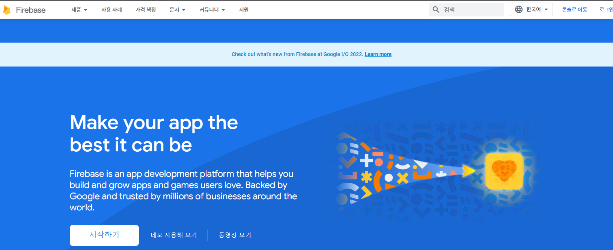
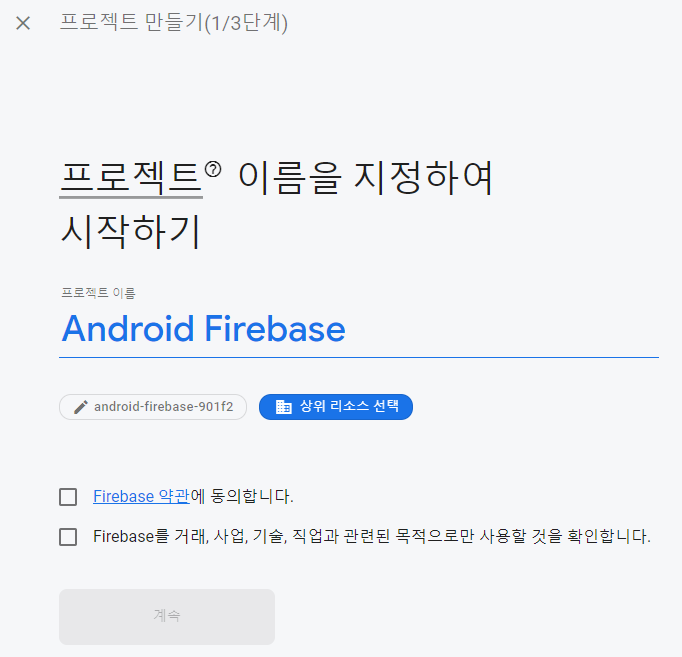
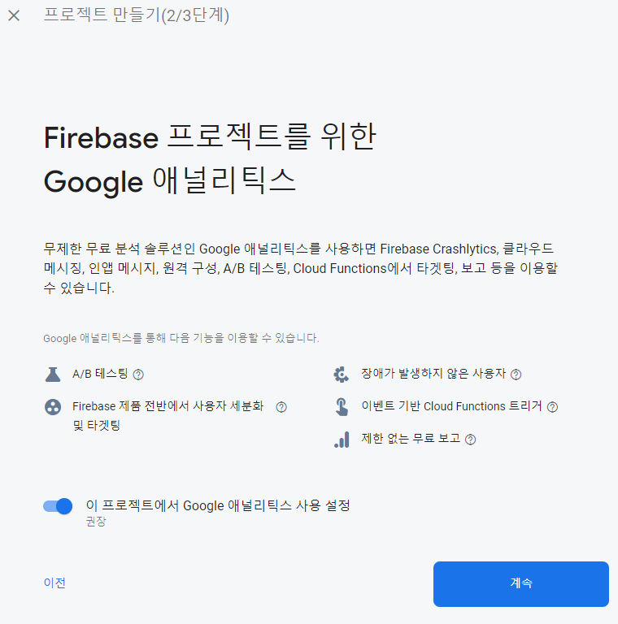
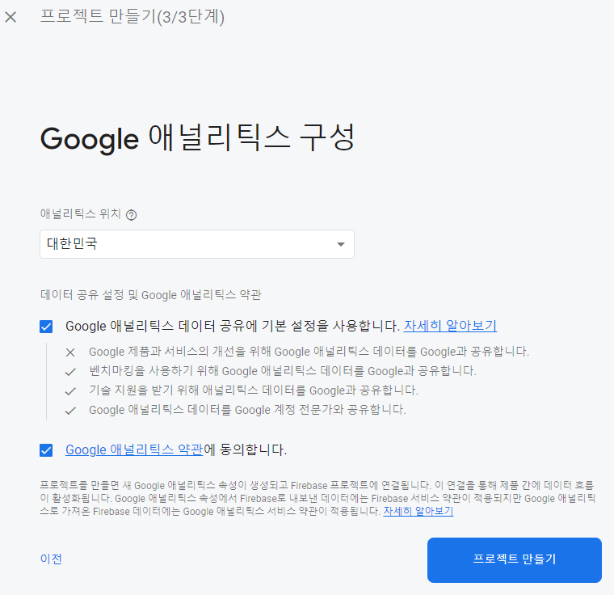
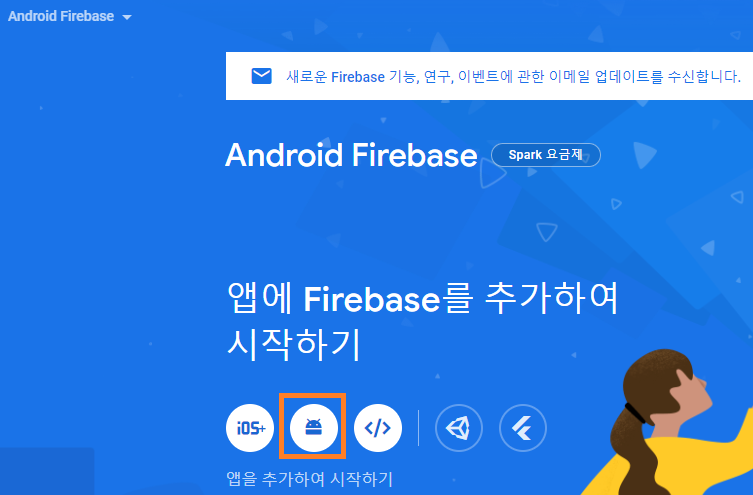
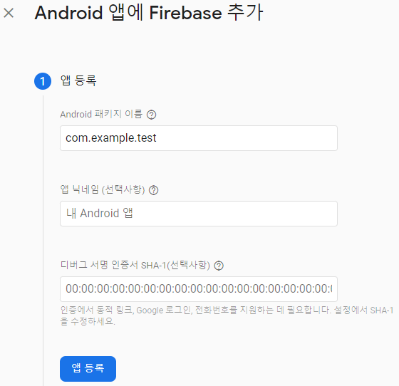
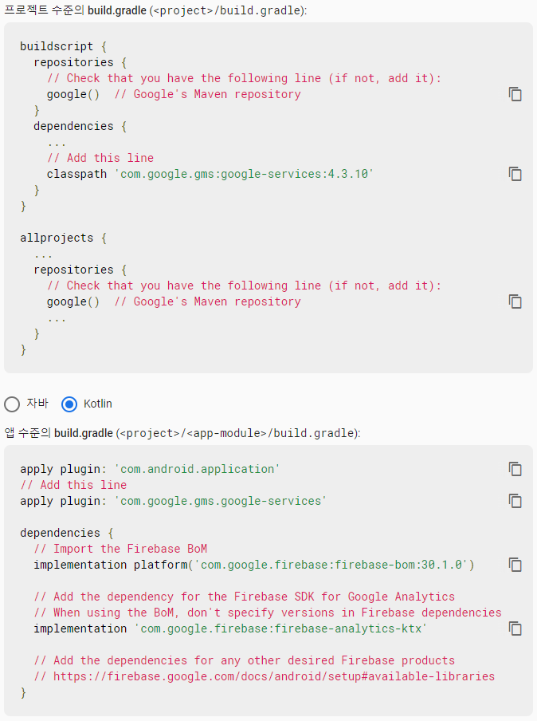
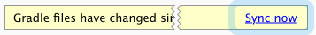

구글에 Firebase입력하시면 아래와 같은 창이 뜨게 됩니다. 이제 시작하기와 프로젝트 만들기를 순서대로 눌러주시면 됩니다.


Firebase는 총 3단계로 이루어져 있습니다. 순서대로 차근차근 입력하시면 됩니다.





프로젝트를 만들고난 다음엔 아래 그림과 같이 안드로이드 모양의 버튼을 클릭해주시면 됩니다.



<br>

이제 프로젝트와 안드로이드를 연결하는 과정으로 총 3가지 과정을 거쳐야 합니다.

<br/>

<strong style="font-size: 18px;">1. Android 앱에 Firebase 추가</strong>




패키지 이름의 경우 manifest 파일 상단에 적혀있는 package를 복붙하시면 됩니다.

```kotlin
<manifest xmlns:android="http://schemas.android.com/apk/res/android"
package="com.example.test">
```

SHA-1를 알고싶으신 경우 [클릭](https://jgeun97.tistory.com/203?category=921973)해주세요!

<br/>

<strong style="font-size: 18px;">2. 구성파일 다운로드</strong>


다운로드 받으신 다음에 그림에 체크되어 있는 대로 해당 위치에 넣어주시면 됩니다.

<strong style="font-size: 18px;">3. Firebase SDK 추가</strong>



<br/>

사진에 적혀있는대로 해당 파일 gradle을 찾아서 위치에 입력해주시면 됩니다.

하지만 현재 플러그인이 업데이트 됨에 따라 project의 build gradle이 달라졌을 텐데요.

에러가 뜨시거나 build gradle이 다르시다면
[클릭](https://jgeun97.tistory.com/202?category=921973) 해주세요

<br/>
마지막으로 IDE의 표시줄에 있는 Sync now를 클릭해주시면 Firebase와 연동이 끝나게 됩니다.

