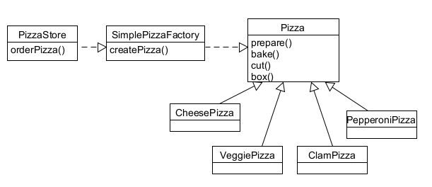
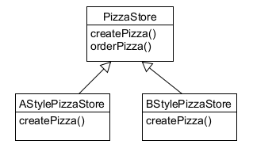

### 코드를 짜면서 객체를 할당할 때 우리는 'new'를 사용합니다.

예를 들어 오리를 종류별로 만든다고 하면 아래와 같이 조건에 따라 만들게 됩니다.

```java
Duck duck;

if(picnic){
    duck=MallardDuck();
}else if(){
    duck=new DecoyDuck();
}else if(inBathTub){
    duck=new RubberDuck();
}
```

이 코드를 보면 구상 클래스의 인스턴스가 여러 개 있으며, 그 인스턴스의 형식은 실행 시에 주어진 조건에 따라 결정된다는 사실을 알 수 있습니다. 이런 코드를 변경하거나 확장할 때는 코드를 다시 확인하고 새로운
코드를 추가하거나 기존 코드를 제거해야 합니다. (OCP에 위배됩니다)
따라서 코드를 이런 식으로 만들면 관리와 갱신이 어려워지고 오류가 생길 가능성도 커집니다.

### 'new' 에 어떤 문제가 있는 걸까요?

인터페이스에 맞춰서 코딩하면 시스템에서 일어날 수 있는 여러 변화에 대응할 수 있습니다. 왜냐하면 다형성으로 인하여 인터페이스를 바탕으로 만들어진 코드는 어떤 클래스든 특정 인터페이스만 구현하면 사용할 수 있기
때문입니다. 반대로 구상 클래스를 많이 사용하면 새로운 구상 클래스가 추가될 때마다 코드를 고쳐야 하므로 수많은 문제가 생길 수 있습니다. 즉 변경에 닫혀 있는 코드가 되는거죠. 새로운 구상 형식을 써서 확장해야할
때는 어떻게 해서든 다시 열 수 있게 만들어야 합니다.

예시로 피자를 만들어보자

```java 
Pizza orderPizza() {

    Pizza pizza = new Pizza();

    pizza.prepare();
    pizza.bake();
    pizza.cut();
    pizza.box();
    
    return pizza;
}
```

피자 종류가 여러 개 있다고 할 때 그에 맞춰서 코드를 추가해야 합니다.

```java
Pizza orderPizza(String type){
    
    Pizza pizza=new Pizza();

    if(type.equals("cheese")){
        pizza=new CheesePizza();
    }else if(type.equals("greek")){
        pizza=new GreekPizza();
    }else if(type.equals("pepperoni")){
        pizza=new PepperoniPizza();
    }

    pizza.prepare();
    pizza.bake();
    pizza.cut();
    pizza.box();
    return pizza;
}
```

orderPizza() 메소드에서 가장 문제가 되는 부분은 인스턴스를 만드는 구상 클래스를 선택하는 부분입니다. 이 부분 때문에 상황이 변하면 코드를 변경해야 합니다.

객체 생성 부분 캡슐화 및 팩토리 만들기

객체 생성을 처리하는 클래스를 팩토리(Factory)라고 부릅니다. 일단 SimplePizza Factory를 만들고 나면 orderPizza() 메소드는 새로 만든 객체의 클라이언트가 됩니다. 즉 피자가 필요할
때마다 피자 공장에 피자 하나 만들어 달라고 부탁한다고 생각하면 됩니다.

이제 인스턴스를 만드는 부분을 따로 뽑아내서 구현해보겠습니다.

```java
class SimplePizzaFactory { 
    
    public Pizza createPizza(String type) { 
        Pizza pizza = null;

        if (type.equals("cheese")) {
            pizza = new CheesePizza();
        } else if (type.equals("pepperoni")) {
            pizza = new PepperoniPizza();
        } else if (type.equals("Clam")) {
            pizza = new ClamPizza();
        } else if (type.equals("veggie")) {
            pizza = new VeggiePizza();
        }
        
        return pizza;
    }
}
```

이렇게 캡슐화했을 때 SimplePizzaFactory를 사용하는 클라이언트가 매우 많을 수도 있기 때문에 여기저기 고칠 필요 없이 팩토리 클래스 하나만 고치면 됩니다.

클라이언트 코드 수정하기

```java
class PizzaStore { SimplePizzaFactory factory;

    public PizzaStore(SimplePizzaFactory factory) {
        this.factory = factory;
    }
    
    public Pizza orderPizza(String type) {
        Pizza pizza;
        
        pizza = factory.createPizza(type);
        
        pizza.prepare();
        pizza.bake();
        pizza.cut();
        pizza.box();
        
        return pizza;
    }
}
```

<팩토리를 이용한 Pizza 구현 방식>



### 다양한 팩토리 만들기

피자를 종류별로 만드는 팩토리를 만들었지만 각 지점마다 그 지역의 특성과 입맛을 반영한 다양한 스타일의 피자를 가지고 있습니다. 
따라서 PizzaStore 코드를 모든 지점에서 활용하려고 할 때 APizzaFactory와 BPizzaFactory에 따라서 Factory를 교체해줘야 합니다.

```java
APizzaFactory aFactory = new APizzaFacotry(); 
PizzaStore aStore = new PizzaStore(aFactory); 
aStore.orderPizza("Veggie");

BPizzaFactory bFactory = new BPizzaFactory(); 
PizzaStore bStore = new PizzaStore(bFactory); 
bStore.orderPizza("Veggie");
```

하지만 프랜차이즈화를 하려면 지점마다 맛이 같아야하는데 지점마다 굽는 방식이 다르거나 만드는 방식이 다르면 문제가 발생합니다. 
따라서 이 문제를 해결하려면 PizzaStore와 피자 제작 코드 전체를 하나로 묶어주는 프레임워크를 만들어야 합니다. 
물론 그렇게 만들면서도 유연성을 잃어버리면 안됩니다.

### 피자 가게 프레임워크 만들기

피자만드는 일 자체를 전부 PizzaStore 클래스에 진행하면서도 지점의 스타일을 살릴 수 있는 방법이 있습니다. 이제 createPizza() 메소드를 PizzaStore에 추상메소드 형태로 선언하고 지역별
스타일에 맞게 PizzaStore의 서브 클래스를 만들겠습니다.

```java
abstract class PizzaStore {

    public Pizza orderPizza(String type) {
        Pizza pizza;

        pizza = createPizza(type);

        pizza.prepare();
        pizza.bake();
        pizza.cut();
        pizza.box();

        return pizza;
    }
    
    abstract Pizza createPizza(String type);
}
```

이제 각 지점에 맞는 서브클래스를 만들어야 합니다.

서브클래스가 결정하는 것 알아보기

이제 PizzaStore를 상속받아 각각 스타일에 맞는 PizzaStore를 만들면 됩니다.



```java
class AStylePizzaStore extends PizzaStore { 
    
    @Override Pizza createPizza(String type) { 
        Pizza pizza = null;

        if (type.equals("cheese")) {
            pizza = new AStyleCheesePizza();
        } else if (type.equals("pepperoni")) {
            pizza = new AStylePepperoniPizza();
        } else if (type.equals("Clam")) {
            pizza = new AStyleClamPizza();
        } else if (type.equals("veggie")) {
            pizza = new AStyleVeggiePizza();
        }
        return pizza;
    }
}
```