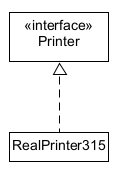
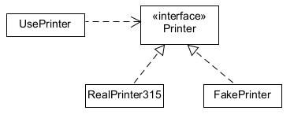

프린터를 관리하는 프로그램이 있다고 가정하자.

```java
public class Printer {
    public Printer() { }

    public void print(Resource r) { ... }
}
```

Printer 클래스를 사용해 프린터를 이용하려면 new Printer()로 생성하면 된다. 하지만 new Printer()를 하면 무한대로 프린터를 할당할 수 있기 때문에 Printer 생성을 막고자하면
private로 선언하면 된다.

```java
public class Printer {
    private Printer() { }

    public void print(Resource r) { ... }
}

```

이렇게 되면 외부에서 Printer를 만들 수 없어서 인스턴스를 제공하는 함수를 생성해야 한다.

```java
public class Printer {
    private static Printer printer = null;

    private Printer() { }

    public static Printer getPrinter() {
        if (printer == null) {
            printer = new Printer();

            return printer;
        }
    }

    public void print(Resource r) { ... }
}
```

getPrinter 코드는 printer가 이미 생성되어 있는지를 판단하여 없다면 새롭게 만들고 반환해주는 함수이다.

이를 이용해 print 함수를 호출해보자

```java
public class User {
    private String name;

    public User(String name) {
        this.name = name;
    }

    public void print() {
        Printer printer = Printer.getPrinter();
        printer.print(this.name + " " + printer.toString());
    }
}

Printer class //생략

public class Main {
    public static void main(String[] args) {
        User[] user = new User[5];
        for (int i = 0; i < 5; i++) {
            user[i] = new User((i + 1) + "-user"); //User 인스턴스 생성 user[i].print(); 
        } 
    } 
}

/* Result */
1 - user Printer @ 54 abe48c
2 - user Printer @ 54 abe48c
3 - user Printer @ 54 abe48c
4 - user Printer @ 54 abe48c
5 - user Printer @ 54 abe48c
```

순서대로 User가 print를 하기 때문에 같은 프린터 인스턴스를 사용하는 걸 확인할 수 있다.

하지만

1. Printer 인스턴스가 아직 생성되지 않았을 때 스레드1이 getPrinter 메서드의 if문을 실행하고 있을 때 printer 변수는 null 이다.

2. 스레드2가 이 때 getPrinter를 호출하면 printer가 null이기 때문에 새롭게 printer를 만들게 된다.

3. 결과적으론 스레드1과 스레드2가 각각의 printer 인스턴스를 갖게된다.

```java
public class UserThread extends Thread {
    public UserThread(String name) {
        super(name);
    }

    public void run() {
        Printer printer = Printer.getPrinter();
        printer.print(Thread.currentThread().getName() + " " +
                printer.toString());
    }
}

public class Printer { 
    
    ...

    public static Printer getPrinter() {
        if (printer == null) {
            try {
                Thread.sleep(1); //스레드 속도 차이를 위함
            } catch (InterruptedException e) {
            }
            printer = new Printer();
        }
        return printer;
    }
        ...
}

public class Client {
    public static void main(String[] args) {
        UserThread[] user = new UserThread[5];

        for (int i = 0; i < 5; i++) {
            user[i] = new UserThread((i + 1) + "-thread");
            user[i].start();
        }
    }
}

/* Result */
3-thread Printer@54abe48c
5-thread Printer@37dcb6a1
1-thread Printer@54abe48c
4-thread Printer@5aab5135
2-thread Printer@7d513daa
```

실행결과를 통해 각 스레드마다 Printer 인스턴스를 만들게 됩니다. 이 자체로는 문제가 없지만 count하거나 데이터를 관리하는 로직이 들어가게 되면 문제가 발생합니다.

이걸 간단하게 해결하는 방법으로는 2가지가 있습니다.

1. 정적 변수에 인스턴스를 만들어 바로 초기화하는 방법

```java
public class Printer {
    private static Printer printer = new Printer();

    private Printer() { }

    public static Printer getPrinter() {
        return printer;
    }
}
```

2. 인스턴스를 만드는 메서드에 동기화하는 방법

```java
public class Printer {
    private static Printer printer = null;
    private int counter = 0;

    private Printer() { }

    public synchronized static Printer getPrinter() {
        if (printer == null) {
            printer = new Printer();
        }
        return printer;
    }

    public void print(String str) { //str: 유저가 호출하는 print 인스턴스 
        counter++;
        System.out.println(str + " " + counter);
    }
}

/* Result */
Printer@5ffdfb42 2
Printer@5ffdfb42 5
Printer@5ffdfb42 3
Printer@5ffdfb42 4
Printer@5ffdfb42 2
```

이 코드의 경우 인스턴스는 정상적으로 제공되지만 counter 변수가 제대로 돌아가지 않습니다. 그렇다면 print함수 역시 synchronized 처리해줍니다.

```java
public class Printer {
    private static Printer printer = null;
    private int counter = 0;

    private Printer() { }

    public synchronized static Printer getPrinter() {
        if (printer == null) {
            printer = new Printer();
        }
        return printer;
    }

    public void print(String str) { //str: 유저가 호출하는 print 인스턴스
        synchronized (this) {
            counter++;
            System.out.println(str + " " + counter);
        }
    }
}

/* Result */
Printer@5ffdfb42 1
Printer@5ffdfb42 2
Printer@5ffdfb42 3
Printer@5ffdfb42 4
Printer@5ffdfb42 5
```

이렇게 처리하면 Counter 역시 잘 체크되는 것을 확인할 수 있다.

싱글톤 패턴 (Singleton Pattern)이란 인스턴스가 오직 하나만 생성되는 것을 보장하고 어디에서든 이 인스턴스에 접근할 수 있도록 하는 디자인 패턴이다.

정적 클래스를 이용하는 방법이 싱글톤 패턴을 이용하는 방법과 가장 차이가 나는 점은 객체를 전혀 생성하지 않고 메서드를 사용한다는 점이다

```java
public class Printer {
    private static int counter = 0;

    public synchronized static void print(String str) {
        counter++;
        System.out.println(str + " " + counter);
    }
}

public class UserThread extends Thread {
    public UserThread(String name) {
        super(name);
    }

    public void run() {
        Printer.print(Thread.currentThread().getName() + " " + printer.toString());
    }
}

public class Client {
    public static void main(String[] args) {
        UserThread[] user = new UserThread[5];

        for (int i = 0; i < 5; i++) {
            user[i] = new UserThread((i + 1) + "-thread");
            user[i].start();
        }
    }
}
/* Result */
3-thread 1 
5-thread 2
1-thread 3
4-thread 4
2-thread 5
```

이렇듯 printer 객체를 생성하지 않아도 counter 변수에 아무 문제 없이 접근할 수 있다. 더욱이 정적 메서드를 사용하므로 일반적으로 실행할 때 바인딩되는 인스턴스 메서드를 사용하는 것보다 성능면에서
우수하다고 할 수 있다.

그러나 정적 클래스를 사용할 수 없는 경우가 있는데 대표적으로 인터페이스를 구현해야하는 경우다.



정적 메서드는 인터페이스에서 사용할 수 없다.

```java
public interface Printer {
    public static void print(String str); //Interface에서 허용 X 

    public class RealPrinter315 implements Printer {
        public synchronized static void print(String str) { ...}
    }
}
```

따라서 위와 같은 코드는 사용할 수 없다.

인터페이스를 사용하는 주된 이유는 대체 구현이 필요한 경우다. 이는 특히 모의 객체를 사용해 단위 테스트를 수행할 때 매우 중요하다.

```java
public class UsePrinter {
    public void doSomething() {
        String str = ...;

        RealPrinter315.print(str);
    }
}

public class RealPrinter315 {
    public synchronized static void print(String str) { 
        ... // 실제 프린터 하드웨어를 조작하는 코드
    }
}
```

가령 실제로 출력해야 하는 프린터가 아직 준비가 되어 있지 않거나 준비가 되었더라도 테스트할 때 결과가 올바른지를 확인하려고 매번 프린터 출력물을 검사하는 것은 매우 번거로운 일이다. 또한 프린터에 따라 테스트 실행
시간에 병목 현상이 나타날 수도 있다.

이 경우 UsePrinter 클래스의 단위 클래스를 실행할 때는 실제 프린터를 테스트용 가짜 프린터 객체로 대체하는 것이 좋다.




이렇게 설계를 변경하면 UsePrinter 클래스는 필요에 따라 실제의 프린터 하드웨어를 구동하는 RealPrinter315나 FakePrinter 클래스를 사용할 수 있게 된다.

```java
public class UsePrinter {
    public void doSomething(Printer printer) {
        String str = ...;

        printer.print(str);
        ...
    }
}

public interface Printer {
    public void print(String str);
}

public class RealPrinter315 implements Printer {
    private static Printer printer = null;

    private RealPrinter315() { }

    public synchronized static Printer getPrinter() {
        if (printer == null) {
            printer = new RealPrinter315();
        }
        return printer;
    }

    public void print(String str) { 
        ... //실제 프린터 하드웨어를 조작하는 코드 
    }
    
    public class FakePrinter implements Printer { //테스트용 가짜 프린터 
        private String str;

        public void print(String str) {
            this.str = str;
        }

        public String get() {
            return str;
        }
    }
}
```

이때 doSomething 메서드로 인터페이스의 단위 테스트를 하는 상황을 가정해 인자를 준다고 하자.

```java
import junit.framework.TestCase;

public class UsePrinterTest extends TestCase {
    public void testdoSomething() {
        FakePrinter fake = new FakePrinter();
        UsePrinter u = new UsePrinter();
        u.doSomething(fake);
        assertEquals("this is a test", fake.get());
    }
}
```

FakePrinter 클래스는 실저 출력을 실행하지 않고 doSomething 메서드를 실행할 때 프린터로 올바른 값이 전달되었는지 확인해야 한다. 따라서 전달된 문자열을 str 문자열 변수에 저장하고 나중에 테스트
케이스에서 get 메서드를 사용해 확인하게 한다.

이 방법외에도 정적 setter 메서드를 사용해 테스트용 대역 클래스를 만들 수 있따. 이렇게 하려면 싱글턴 클래스에 정적 setter 메서드를 추가하면 된다. 이 메서드는 인자로 싱글턴 클래스 인스턴스 객체를
참조하도록 하여 실제의 싱글톤 객체를 대신하도록 적절한 변수에 설정한다.

```java
public class UsePrinter {
    public void doSomething() {
        String str = ...;

        PrinterFactory.getPrinterFactory().getPrinter().print(str);
        ...
    }

    public void print(str);
}

public class PrinterFactory {
    private static PrinterFactory printerFactory = null;

    protected Printer() { } // 접근 제한자를 protected로 변경

    public synchronized static PrinterFactory getPrinterFactory() {
        if (printerFactory == null) {
            printerFactory = new PrinterFactory();
        }
        return printerFactory;
    }

    public static void setPrinterFactory(PrinterFactory p) { // 정적 setter 메서드 
        printerFactory = p;
    }

    public Printer getPrinter() {
        return new Printer();
    }


    public class FakePrinterFactory extends PrinterFactory {
        public Printer getPrinter() {
            return new FakePrinter();
        }
    }
}
```

```java
import junit.framework.TestCase;

public class DoSomeThingTest extends TestCase {
    public void testdoSomething() {
        FakePrinterFactory fake = new FakePrinterFactory();
        UsePrinter u = new UsePrinter();
        PrinterFactory.setPrinter(fake); // 가짜 Printer 객체 주입
        u.doSomething(); // 가짜 프린터 사용 작업 실행 
        ...
    }
}
```
