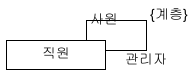

### 모델링 (Modeling)

- 서로의 해석을 공유해 합의를 이루거나 해석의 타당성을 검토
- 현재 시스템 또는 앞으로 개발할 시스템의 원하는 모습을 가시화
- 시스템의 구조와 행위를 명세할 수 있으며 시스템을 구축하는 틀을 제공
- 모델은 추상화 (abstraction)에 바탕을 두고 만들어져야 함
- 추상화는 대상을 표현할 때 특정 관점에서 관련이 있는 점은 부각시키고 관련이 없는 면은 무시하는 것이 필요         ex) 대학교 학사 지원 업무 - 학생의 머리색은 관련이 없지만 학번이나 수강 과목 등은 매우 중요한 요소

### UML (Unified Modeling Language): 시스템을 모델로 표현해주는 언어

- 시스템 개발 과정에서 개발자 사이의 의사 소통이 원할하게 이루어지도록 표준화한 통합 모델링 언어
- 시스템의 구조와 동작을 표현하는 13개의 다이어그램을 제공하는 이유는 다양한 관점에서 시스템을 모델링 하기 위함

### 클래스 다이어그램

- 시간에 따라 변하지 않는 시스템의 정적인 면을 보여주는 대표적인 UML 구조 다이어그램
- 시스템을 구성하는 클래스와 그들 사이의 관계를 보여준다

#### 1) 클래스

- 클래스를 보는 또 하나의 관점은 객체를 생성하는 설계도로 간주하는 것
```java
public class Dog {
	private String name;
    
    public void bark() {
    	System.out.println(name + "~~~" + "짖습니다");
    }
    
    public Dog(String name) {
    	this.name = name;
    }
}
```

위 코드가 Dog 클래스를 만들어내는 설계도라고 생각할 때

 왼쪽 그림과 같이 UML 클래스를 표현할 수 있다

- 클래스 이름 / 클래스의 특징을 나타내는 속성 / 클래스가 수행하는 책임 (연산) 으로 나뉜다
- 경우에 따라 속성(중간)과 연산 부분은 생략가능하다
- 속성과 연산의 가시화 정의  ( +: public, - : private,  protected: #, package: ~ )

### 2) 관계

#### (1) 연관 관계 (association)

- 클래스들이 개념상 서로 연결되었음을 나타냄
- 실선이나 화살표로 표시하며 보통은 한 클래스가 다른 클래스에서 제공하는 기능을 사용하는 상황일 때 표시함
- 두 클래스 사이의 연관관계가 명확한 경우에는 연관관계 이름("상담한다")을 사용하지 않아도 된다
- 역할 이름은 프로그램을 구현할 때 연관된 클래스의 객체들이 서로를 참조할 수 있는 속성의 이름으로 활용할 수 있다


- 위와 같은 그림은 양방향 연관 관계이기에 화살표를 사용하지 않습니다.
- 두 클래스의 객체들이 서로의 존재를 인식한다는 의미.


- 위의 그림은 단방향으로서 학생은 자신이 수강하는 과목을 알지만
과목은 자신이 수강하는 학생들의 존재를 모른다는 사실을 의미한다

<br/>

- 연관 클래스는 연관 관계에 추가할 속성이나 행위가 있을 때 사용한다
- 연관 관계가 있는 두 클래스 사이에 위치하며, 연관 관계를 나타내려고 연결하는 선 중앙에서 연관 클래스까지 점선을 사용해 연결한다


- 왼쪽의 연관 클래스를 오른쪽처럼 표현할 수 있다



- 연관 관계는 때로는 재귀적일 수 있다                                                                                                                              ex) A가 B의 관리자이며 B가 C의 관리자 일 때 B는 관리자이며 사원이다 (모순 발생)
- 재귀적 연관 관계는 제약을 설정 함으로서 해결되지 않은 문제점 (관계의 루프: A->B, B->C, C->A / ->는 관리한다는 뜻) 을 배제한다.


#### (2) 일반화 관계 (generalization)

- 객체지향 개념에서의 상속 관계
- 한 클래스가 다른 클래스를 포함하는 상위 개념(IS-A 관계)일 때 모델링
- 속이 빈 화살표를 사용해 표시


- 부모 클래스에 구현되지 않은 연산이 있다면 추상 메서드라 하며 이것을 가지는 클래스를 "추상 클래스"
- 추상클래스는 객체를 생성할 수 없고 이탤릭체로 써서 구분하거나 스테레오 타입 (sterotype  - << name >>)으로 표시


#### (3) 집합 관계 (composition) 와 합성 관계 (aggregation)

- 클래스들 사이의 전체 또는 부분 같은 관계를 나타냄
- <strong>집약 관계</strong>
    - 한 객체가 다른 객체를 포함하는 것
    - '전체', '부분'과의 관계이며 '전체'를 가리키는 클래스 방향에 빈 마름모로 표시
    - 부분을 나타내는 객체를 다른 객체와 공유할 수 있는 경우 집약관계로 나타냄
    - 전체 객체의 라이프타임과 부분 객체의 라이프타임은 독립적 - 전체 객체가 사라져도 부분 객체는 사라지지 않음

      

  - 아래의 코드처럼 외부에서 이들 객체를 참조만 받아 사용했기 때문에 Car 클래스가 사라지더라도 나머지 객체들은 살아 있는 경우 "<strong>집약 관계</strong>"
```java 
public class Car {
private Engine engine;
private Handle handle;
private Wheel wheel;

	public Car(Engine engine, Handle handle, Wheel wheel) {
		this.engine = engine;
		this.handle = handle;
		this.wheel = wheel;
	}
}
```

- <strong>합성 관계</strong>
  - 전체를 가리키는 클래스 방향에 채워진 마름모로 표시
  - 부분 객체가 전체 객체에 속하는 관계
  - 부분 객체의 라이프타임은 전체 객체의 라이프타임에 의존 (전체 객체가 사라지면 부분 객체도 사라짐)
    
     
    
  - 아래의 코드처럼 Car 내부에서 객체할당을 하였기에 Car 클래스가 사라지면 Engine, Handle, Wheel 객체도 같이 사라지는 경우 "<strong>합성 관계</strong>"
```java
public class Car {
private Engine engine;
private Handle handle;
private Wheel wheel;

	public Car() {
		this.engine = new Engine();
		this.handle = new Handle();
		this.wheel = new Wheel();
	}
}
```


#### (4) 의존 관계 (dependency)

- 연관 관계와 같이 한 클래스가 다른 클래스에서 제공하는 기능을 사용할 때를 나타냄
- 차이점은 두 클래스의 관계가 한 메서드를 실행하는 동안과 같은, 매우 짧은 시간만 유지됨
- 점선 화살표를 사용해 표시
- 보통 3가지 경우에 의존함
  - 클래스의 속성에서 참조할 때
  - 연산의 인자로 사용될 때
  - 메서드 내부의 지역 객체로 참조될 때
- 예시: 자동차의 경우 정해진 주유소에서만 주유할 수 없기에 매번 주유소가 달라짐
```java
public class Car {
...

    public void fillGas(GasPump p) {
       p.getGas(amount);
       ...
    }
}
```


#### (5) 실체화 관계 (realization)

- 책임들의 집합인 인터페이스와 이 책임들을 실제로 실현한 클래스들 사이의 관계를 나타냄
- 상속과 유사하게 빈 삼각형을 사용하며 머리에 있는 실선 대신 점선을 사용해 표시
- 인터페이스를 공통되는 능력이 있는 것들을 대표하는 관점으로 볼 수 있다. ex) 새, 비행기 - 날 수 있다


일반화 관계는 'is a kind of' 관계지만 실체화 관계는 'can do this' 관계