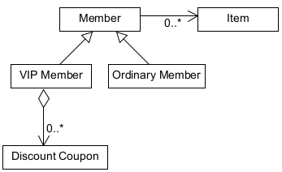
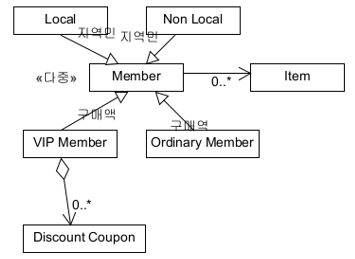
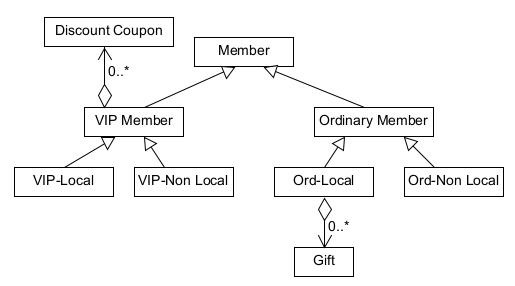
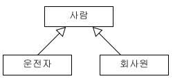
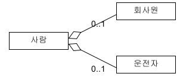

### 추상화

어떤 영역에서 필요로 하는 속성이나 행동을 추출하는 작업
```java
// 각 자동차마다 case를 나누는 것보다
switch(자동차 종류) {
   case 아우디:
   case 벤츠:
   case BWM:
}

// 추상화를 통해 공통된 부분인 car이라는 클래스로 처리할 수 있다
void changeEngineOil(Car c) {
   c.changeEngineOil();
}
```

### 응집도와 결합도
응집도: 클래스나 모듈 안의 요소들이 얼마나 밀접하게 관련되어 있는지를 나타냄

결합도: 어떤 기능을 실행하는 데 다른 클래스나 모듈들에 얼마나 의존적인지를 나타냄

-> 높은 응집도와 낮은 결합도를 유지할 수 있도록 설계해야 요구사항을 변경할 때 유연하게 대처할 수 있다
### 캡슐화

낮은 결합도를 유지할 수 있도록 해주는 객체지향 설계 원리

정보 은닉을 통해 높은 응집도와 낮은 결합도를 갖는다

-> 정보은닉 (Information Hiding) : 알 필요가 없는 정보는 외부에서 접근하지 못하도록 제한하는 것)

       ex) 자동차를 운전하는 데에 엔진의 동작 원리를 몰라도 전혀 지장이 없다

한 클래스의 변경은 변경된 클래스의 비밀에 의존하는 다른 클래스들도 변경해야할 가능성이 커진다는 뜻,

즉 결함이 발생할 가능성이 높아진다

### 일반화 관계

객체지향 프로그래밍관점에서의 상속 관계
```java
// 과일이 추가됨에 따라 항상 코드를 수정해줘야함
int total = 0
while(장바구니에 과일이 있다) {
switch(과일 종류) {
case apple:
case banana:
case orange:
}
}

<!-- 일반화를 통한 코드 수정 -->
int total = 0
Iterator<Fruit> itr = fruits.iterator();

while(itr.hasNext()) {
Fruit curFruit = itr.next();
total = total + curFruit.calculatePrice();
}
```
여기서 calculatePrice 매서드는 실제 과일 객체의 종류에 따라 다르게 실행된다 (다형성)

### 위임 (delegation)

어떤 클래스의 일부 기능만 재사용하고 싶은 경우 사용

자신이 직접 기능을 실행하지 않고 다른 클래스의 객체가 기능을 실행하도록 위임하는 것

일반화 관계는 클래스 사이의 관계지만 위임은 객체 사이의 관계

<과정>
1. 자식 클래스에 부모 클래스의 인스턴스를 참조하는 속성을 만들고 이 속성 필드를 this로 초기화한다 
2. 서브 클래스에 정의된 각 메서드에 1번에서 만든 위임 속성 필드를 참조하도록 변경한다
3. 서브 클래스에서 일반화 관계 선언을 제거하고 위임 속성 필드에 슈퍼 클래스의 객체를 생성해 대입한다
4. 서브 클래스에서 사용된 슈퍼 클래스의 메서드에도 위임 메서드를 추가한다
5. 컴파일하고 잘 동작하는지 확인한다
    
```java
public class MyStackDelegation<String>{
   private ArrayList<String> arList = new ArrayList<String>();
   
   public void push(String element) {
      arList.add(element);
   }
   
   public String pop() {
      return arList.remove(size() - 1);
   }
   
   public boolean isEmpty() {
      return arList.isEmpty();
   }
   
   public int size() {
      return arList.size();
   }
}
```

### 집합론 관점으로 본 일반화 관계

VIP 회원과 보통 회원은 각각 Item을 가지고 Member에 속하는 클래스 다이어 그램을 변경한 모습


#### 특수화
일반화의 역관계, 즉 부모 클래스에서 자식 클래스를 추출하는 과정

어떤 속성이나 연관 관계가 특정 자식 클래스에서만 관련이 있고 다른 자식 클래스에서는 관련이 없는 경우 사용

VIP Member와 Ordinary Member가 관계만 봤을 땐 차이가 없기 때문에 discount coupon을 제공함으로서 회원을 VIP와 일반으로 특수화하는 이유가 되는 것이다



#### 변별자

지역 주민인지 아닌지와 같이 나누는 분류 기준을 제공

다중 분류: 한 인스턴스가 동시에 여러 클래스에 속할 수 있는 것, <<다중>>

요구사항의 변경이나 새로운 요구사항의 추가에 따라 두 일반화 관계가 더이상 독립적이지 않은 상황도 고려




첫번째 모델에서 일반 회원이지만 지역 주민에게는 경품을 제공하는 요구사항을 추가하면 "일반 회원"에 초점을 맞추면 비지역민에게도 경품이 제공될 수 있고 "지역 주민"에 초점을 맞추면 VIP 멤버에게도 경품이 제공될 수 있는 잘못된 모델링이다. 

따라서 두번째 모델처럼 계층적 구조를 통해 중복이 생기지 않도록 처리해야합니다.

### 다형성

서로 다른 클래스의 객체가 같은 메세지를 받았을 때 각자의 방식으로 동작하는 능력

```java
public abstract class Pet {
   public abstract void talk();
}

public class Cat extends Pet {
   public void talk() {
      System.out.println("야~옹");
   }
}

public class Dog extends Pet {
   public void talk() {
      System.out.println("멍멍");
   }
}
```

### 피터 코드의 상속 규칙

상속의 오용을 막기위해 상속의 사용을 엄격하게 제한하는 규칙들을 만들게 됨

- 자식 클래스와 부모 클래스 사이는 "역할 수행" 관계가 아니어야 한다
- 한 클래스의 인스턴스는 다른 서브 클래스의 객체로 변환할 필요가 절대 없어야 한다
- 자식 클래스가 부모 클래스의 책임을 무시하거나 재정의하지 않고 확장만 수행해야 한다
- 자식 클래스가 단지 일부 기능을 재사용할 목적으로 유틸리티 역할을 수행하는 클래스를 상속하지 않아야 한다
- 자식 클래스가 '역할', '트랜잭션', '디바이스' 등을 특수화해야 한다



위의 클래스 다이어그램을 바탕으로 피터 코드의 5가지 규칙을 살펴보자


1. 자식 클래스가 부모 클래스의 역할 중 하나를 표현하는지를 점검해보자

-> 운전자나 회사원은 사람이 수행하는 역할의 하나이기에 상속 관계로 표현되어서는 안된다


2. 자식 클래스의 인스턴스들 사이에 변환 관계가 필요한지를 점검해보자

-> 회사원이 운전하면 운전자가 될 수 있기에 이런 경우 객체의 변환 작업이 필요하므로 규칙에 위배된다


3. 부모 클래스의 책임을 무시하거나 재정의하지 않고 확장만 수행

-> 어떤 속성과 연산이 정의되었는지 정보가 없다


4. 기능만 재사용할 목적으로 상속 관계를 표현하지 않았으므로 규칙을 준수한다


5. 슈퍼 클래스가 역할, 트랜잭션, 디바이스를 표현하지 않았으므로 규칙에 위배된다

따라서 아래와 같이 집약관계로서 표현하는 것이 좋습니다

