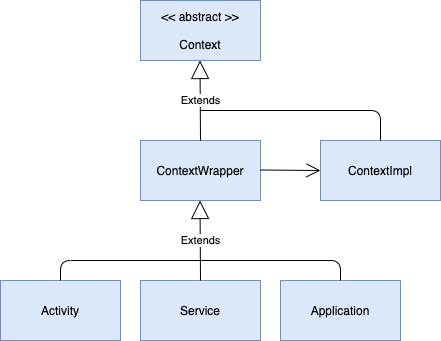

### 공부 배경

android context를 공부하며 context, contextImpl, contextWrapper가 프록시패턴으로 이뤄져있다는 것을 확인할 수 있었습니다. 왜 프록시를 사용하여 아래 그림과 같이 구현된 것인지
공부해보려고 합니다.



프록시 패턴이란? 프록시는 대리인이라는 뜻으로, 무엇인가를 대신 처리하는 의미입니다. 일종의 비서라고 생각하면 됩니다. 연예인에게 먼저 접촉하기 전에 매니저과 일정조율을 하듯 먼저 구현체가 아닌 프록시에게 먼저
물어보는 개념입니다. 이렇게 어떤 객체를 사용하고자 할 때, 객체를 직접 참조하는 것이 아니라, 해당 객체를 대행하는 객체를 통해 대상 객체에 접근하는 방식을 사용하면 해당 객체가 메모리에 존재하지 않아도 기본적인
정보를 참조하거나 설정할 수 있고 또한 실제 객체의 기능이 반드시 필요한 시점까지 객체의 생성을 미룰 수 있습니다.

=> 생성 시점을 미루는 이유

구현체의 경우 굉장히 많은 기능을 갖고 있는 경우가 많아서 생성하는데 오랜 시간이 걸릴 수 있습니다. 다양한 기능을 가진 앱을 실행할 때 기능이 많은 만큼 빌드할 때 오래걸리는 것과 동일한 이유입니다.


### 프록시 패턴의 장점

1. 사이즈가 큰 객체 (ex: 이미지)가 로딩되기 전에도 프록시를 통해 참조를 할 수 있다

2. 실제 객체의 public, protected 메소드들을 숨기고 인터페이스를 통해 노출시킬 수 있다.

3. 로컬에 있지 않고 떨어져 있는 객체를 사용할 수 있다.

4. 원래 객체의 접근에 대해서 사전처리를 할 수 있다.

### 프록시 패턴 단점

1. 객체를 생성할 때 한단계를 거치게 되므로, 빈번한 객체 생성이 필요한 경우 성능이 저하될 수 있다.

2. 프록시 내부에서 객체를 생성하기 위해 스레드가 생성, 동기화가 구현되야 하는 경우 성능이 저하될 수 있다.

3. 로직이 난해해져 가독성이 떨어질 수 있다.

### 프록시가 사용되는 대표적인 3가지

#### 가상프록시

꼭 필요로 하는 시점까지 객체의 생성을 연기하고, 해당 객체가 생성된 것처럼 동작하도록 만들고 싶을 때 사용하는 패턴입니다. 프록시 클래스에서 자잘한 작업들을 처리하고 리소스가 많이 요구되는 작업들이 필요할 때에만
주체 클래스를 사용하도록 구현하며 위에서 예로 들었다시피 해상도가 아주 높은 이미지를 처리해야 하는 경우 작업을 분산하는 것을 예로 들 수 있습니다.

#### 원격프록시

원격객체에 대한 대변자 역할을 하는 객체. 서로다른 주소 공간에 있는 객체에 대해 마치 같은 주소 공간에 있는 것처럼 동작하게 만드는 패턴입니다. 예시로 Google Docs를 들 수 있습니다. 브라우저는
브라우저대로 필요한 자원을 로컬에 가지고 있고 또다른 자원은 Google 서버에 있는 형태입니다.

#### 보호프록시 <-  [Android](https://developer.android.com/reference/kotlin/android/content/ContextWrapper) 의 경우

주체 클래스에 대한 접근을 제어하기 위해 객체에 대한 접근 권한을 제어하거나 객체마다 접근 권한을 달리하고 싶을 때 사용하는 패턴으로 프록시 클래스에서 클라이언트가 주체 클래스에 대한 접근을 허용할지 말지 결정하도록
할 수 있습니다.

> Proxying implementation of Context that simply delegates all of its calls to another Context. Can be subclassed to modify behavior without changing the original Context.
>
>Context의 프록시 구현은 단순히 모든 호출을 다른 컨텍스트에 위임합니다. Original Context의 수정 없이 서브 클래스의 행위를 수정할 수 있다. (ContextImpl이 아닌 ContextWrapper가 호출하도록 위임하며 ContextWrapper에서 수정이 일어나도 ContextImpl에는 영향이 가지 않습니다.)

### 프록시패턴 구현

유튜브를 보면 영상 목록이 있고 마우스를 올리면 영상이 프리뷰 형태로 재생되는 방식인데 영상 목록을 구성할 때는 영상 정보가 없어도 됩니다. 하지만 프리뷰를 보여주기 위해서는 영상 정보가 존재해야하기에
Proxy객체로 영상 목록만 처리하고 마우스를 올려서 프리뷰를 보려고 할 때 영상 객체를 생성해서 보여주면 됩니다.

또한 영상 이름을 바꾸는 기능을 Proxy 객체가 클라이언트의 권한에 따라 제어하는 것 역시 예시로 만들어 보겠습니다.

먼저 Subject(Service Interface)를 만듭니다.

```java
interface YoutubeService {

    void showPreview();

    void setName(String name);
}
```

이제 실제 Service를 구현하는 객체를 만들어 보겠습니다.

```java
class YoutubeServiceImpl implements YoutubeService {

    private String name;

    public YoutubeServiceImpl(String name) {
        this.name = name;
    }

    @Override
    public void showPreview() {
        System.out.println(name + " Preview Play");
    }

    @Override
    public void setName(String name) {
        System.out.println(this.name + "에서 " + name + "으로 이름 수정 완료");
        this.name = name;
    }
}
```

Proxy를 만들기 전에 Client객체를 만들어보겠습니다. Client는 권한에 따라 유튜브 제목을 수정할 수 있습니다.

```java
class Client {
    AccessAuth accessAuth;

    public Client(AccessAuth accessAuth) {
        this.accessAuth = accessAuth;
    }
}

enum AccessAuth {
    OWNER, GUEST
}
```

그 다음 Proxy를 만들어보겠습니다.

```java
class YoutubeServiceProxy implements YoutubeService {
    private YoutubeService youtubeService;
    private String name;
    private Client client;

    public YoutubeServiceProxy(String name, Client client) {
        this.name = name;
        this.client = client;
    }

    void showTitle() {
        System.out.println(name + " Youtube Video");
    }

    @Override
    public void showPreview() {
        loadYoutubeVideo();
        youtubeService.showPreview();
    }

    private void loadYoutubeVideo() {
        if (youtubeService != null) {
            System.out.println("Cache File Exist!");
        } else {
            System.out.println("load Video");
            youtubeService = new YoutubeServiceImpl(name);
        }

    }

    @Override
    public void setName(String name) {
        if (client.accessAuth == AccessAuth.GUEST) {
            System.out.println("Guest는 이름 수정 불가");
        } else if (client.accessAuth == AccessAuth.OWNER) {
            loadYoutubeVideo();
            youtubeService.setName(name);
        }
    }
}
```

Proxy 객체에서는 실제 비디오 객체가 없더라도 보여줄 수 있는 showTitle() 메서드와 비디오 객체가 필요할 때 로드할 수 있는 loadYoutubeVide() 메서드가 추가적으로 구현되어 있습니다.

비디오 객체가 필요 없을 때는 Proxy가 자체적으로 처리하다가 비디오 객체가 반드시 필요한 부분에서는 비디오 객체를 로드하는 방식으로 구현했습니다.

```java
class Main {
    public static void main(String[] args) {
        Client owner = new Client(AccessAuth.OWNER);
        YoutubeServiceProxy youtubeService = new YoutubeServiceProxy("Game Video", owner);
        youtubeService.showTitle();
        youtubeService.showPreview();
        youtubeService.setName("LOL 게임 중");
    }
}

// Result
// Game Video Youtube Video
// load Video
// Game Video Preview Play
// Cache File Exist!
// Game Video에서 LOL 게임 중으로 이름 수정 완료
```

위의 결과를 보면 title을 호출할 땐 Proxy가 처리하고 비디오처리가 필요한 부분에서 ServiceImpl 객체를 생성하는 것을 확인할 수 있었습니다.

위의 코드는 가상프록시의 예시입니다.

안드로이드에서 context에 프록시 패턴을 적용한건 보호프록시로 개발자가 ContextImpl에 직접적으로 관여하게 될 경우 큰 장애를 일으킬 수 있기 때문에 이를 보호하기 위해 ContextWrapper를 통해
보호한 것입니다.

<참고>

https://coding-factory.tistory.com/711

https://icksw.tistory.com/248