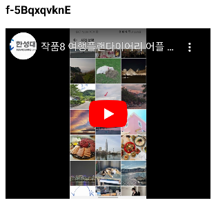

### 배경

이번에 프로젝트를 진행하면서 사용자들이 관심있어할만한 주제의 유튜브 영상들을 제공하고자 했습니다. 따라서 안드로이드 앱에서 유튜브를 임베디드 하는 방법을 공부해봤습니다!

### 설명에 앞서..

저는 이번에 유튜브 developer 사이트를 참고하여 적용해볼까 고민을 했지만 생각보다 자세히 나와있지 않았습니다.

https://developers.google.com/youtube/android/player

그래서 저는 PierfrancescoSoffritti가 만든 android-youtube-player 라이브러리를 사용했습니다.

### 구현

1. 우선 build.gradle(App)에 implementation을 추가해줍니다.

```kotlin
implementation 'com.pierfrancescosoffritti.androidyoutubeplayer:core:11.1.0'
```

2. 가져오고 싶은 동영상 url을 복사해옵니다. 저는 제가 참여했던 공학경진대회 발표 영상을 가져왔습니다.

url: https://www.youtube.com/watch?v=f-5BqxqvknE

여기서 youtube의 아이디는 f-5BqxqvknE 입니다.

3. YouTubePlayerView를 Xml에 설정하고 videoId를 넣어줍니다.

```xml

<com.pierfrancescosoffritti.androidyoutubeplayer.core.player.views.YouTubePlayerView
        android:id="@+id/youtube_video"
        android:layout_width="match_parent"
        android:layout_height="300dp"
        app:autoPlay="false"
        app:videoId="f-5BqxqvknE"/>
```

설정을 마쳤다면 다음과 같이 나오게 됩니다.



4. YouTubePlayerView는 databinding이 적용되지 않습니다.

만약 적용하게 되면 다음과 같이 에러가 뜨게 됩니다.

```kotlin
[databinding] {"msg":"Cannot find a setter for \u003ccom
.pierfrancescosoffritti.androidyoutubeplayer.core.player.views.YouTubePlayerView
```

5. 동적으로 videoId를 적용하고 싶다면 addYouTubePlayerListener를 적용하면 됩니다.

```kotlin
lifecycle.addObserver(binding.youtubeVideo)
binding.youtubeVideo.addYouTubePlayerListener(object: AbstractYouTubePlayerListener() { override fun onReady(
youTubePlayer: YouTubePlayer) { val videoId = "TNJji6adgbY"
youTubePlayer.cueVideo(videoId, 0f)
} })
```
- cueVideo: 동영상을 로딩하지만 자동재생되지 않습니다.

- loadVideo: 동영상을 로딩하자마자 재생됩니다.

### 코드
https://github.com/JGeun/Android_Study/tree/master/YoutubeTest

### 참고
https://github.com/PierfrancescoSoffritti/android-youtube-player