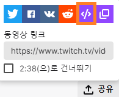
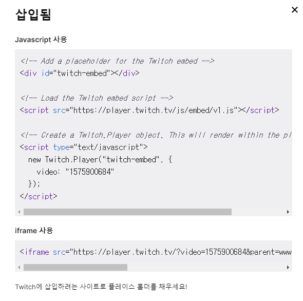

### 배경

이번에 Android에 트위치 영상을 넣고 싶어서 도전해봤습니다. 하지만 아직 트위치에서는 Mobile을 제공하고 있지 않다고 하네요. 그래서 트위치 임베디드를 공부하는 동안 배웠던 웹사이트에 공유하는 방법에 대해
정리해보려 합니다.


### IFrame 코드 구성

트위치에서 제공하는 Twitch Developers에 따르면 iframe 형식으로 제공하면 된다고 합니다.

https://dev.twitch.tv/docs/embed/video-and-clips/#non-interactive-iframes-for-clips

```html

<iframe
        src="https://player.twitch.tv/?<channel, video, or collection>&parent=streamernews.example.com"
        height="<height>"
        width="<width>"
        allowfullscreen>
</iframe>
```


여기서 핵심은 parent로 올리고자 하는 웹사이트를 적어주셔야 합니다.

예를 들어 제 블로그 주소는 jgeun97.tistory.com 이니까 parent=jgeun97.tistory.com 형식으로 적어주셔야 해요.

### iframe 코드 가져오기
트위치 영상쪽에서 손쉽게 가져올 수 있어요. 동영상 아래에 공유 버튼을 누르고 소스코드 버튼을 클릭하면 됩니다.






### 예시
(앰비션님 트위치 영상을 예시로 테스트하였습니다 문제될 시 삭제하겠습니다)

```html
<iframe src="https://player.twitch.tv/?video=1575900684&parent=jgeun97.tistory.com" 
        frameborder="0" allowfullscreen="true" 
        scrolling="no" height="378" width="620"></iframe>
```

####<참고>

https://dev.twitch.tv/docs/embed/video-and-clips

https://discuss.dev.twitch.tv/t/twitch-embedded-player-updates-in-2020/23956/120

https://grandvert.tistory.com/521

