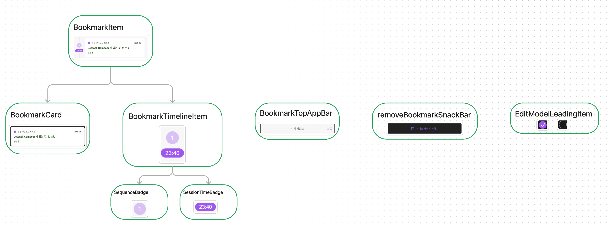

## 1. Android Compose PreviewParameter 학습
https://jgeun97.tistory.com/364

## 2. 드로이드나이츠 Repo - Bookmark Compose 컴포넌트 구성 파악
- 김수현님의 안드로이드 Compose UI 컴포넌트 설계를 보고 드로이드 나이츠의 특정 피쳐 UI 구조를 파악해봄
- 정말 작은 단위의 컴포넌트부터 시작하는 것을 확인할 수 있었고, Stateless/Stateful한 컴포넌트 설계가 필요하다고 느낌

### 링크
1) https://github.com/droidknights/DroidKnightsApp/tree/main/feature/bookmark/src/main/java/com/droidknights/app/feature/bookmark/component
2) https://speakerdeck.com/wisemuji/droidknights-2024-compose-ui-keomponeonteu-seolgyewa-teseuteu

