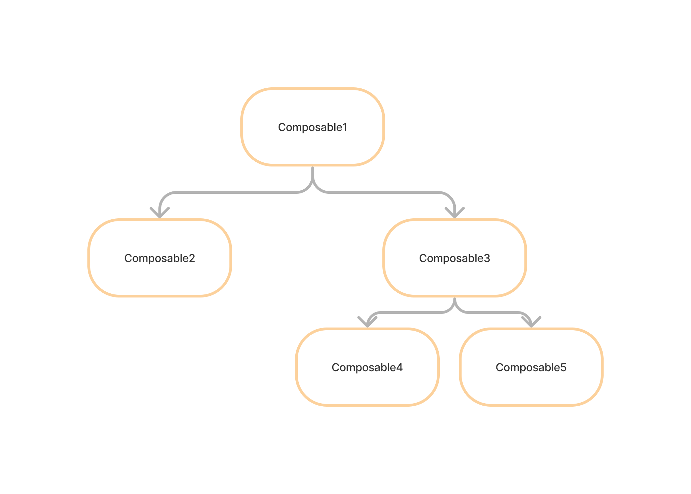
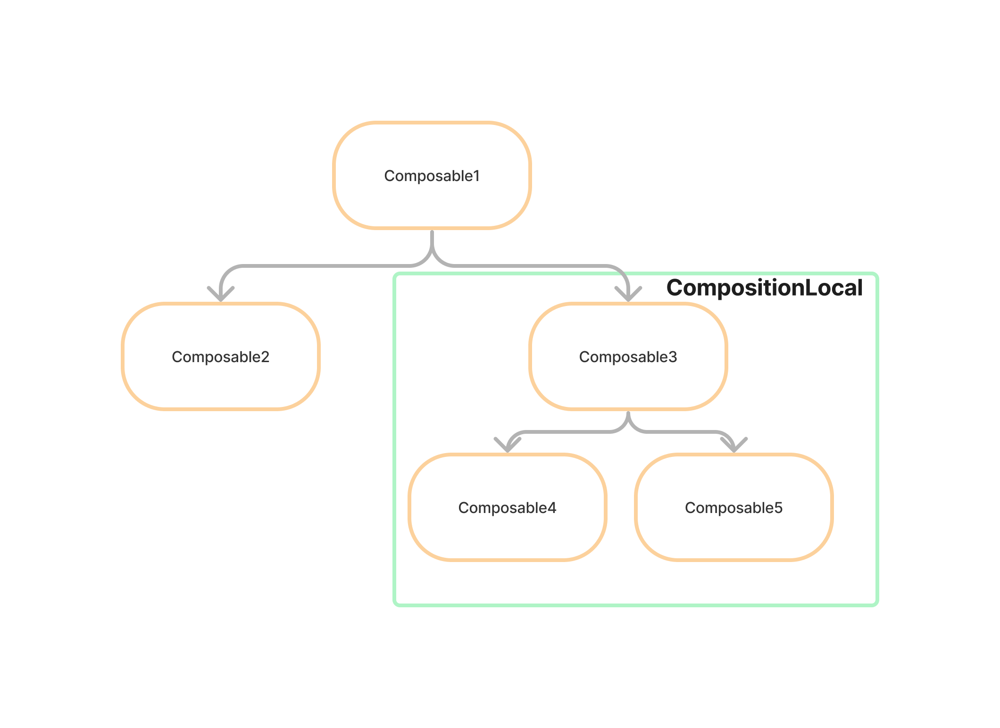
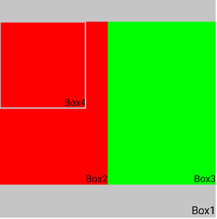

## Android Compose CompositionLocal

### CompositionLocal
Compose에서 각 Composable 함수의 매개변수는 UI 트리를 통해 아래로 흐르는 구조입니다. 



이런 구조는 색상이나 유형 스타일과 같이 매우 자주 널리 사용되는 데이터의 경우에는 번거로울 수 있습니다.

```kotlin
@Composable
fun MyApp() {
    val colors = colors()
}

@Composable
fun SomeTextLabel(
    labelText: String,
    colors: Color
) {
    Text(
        text = labelText,
        color = colors.onPrimary
    )
}
```

색상을 대부분의 컴포저블에 명시적 매개변수 종속 항목으로 전달할 필요가 없도록 지원하기 위해 Compose는 <b>CompositionLocal</b>을 제공합니다. 

다음 그럼처럼 compositionLocal로 선언된 상태라면 하위 컴포너블 함수들에서 전부 접근 가능합니다



처음 앱을 켰을 때 볼 수 있는 MaterialTheme도 CompositionLocal을 내부적으로 사용하고 있습니다.

```kotlin
@Composable
fun MyApp() {
    MaterialTheme {
        // ...
    }
}

@Composable
fun SomeTextLabel(
    labelText: String
) {
    Text(
        text = labelText,
        color = MaterialTheme.colors.primary
    )
}

@Composable
fun MaterialTheme(
  colorScheme: ColorScheme = MaterialTheme.colorScheme,
  shapes: Shapes = MaterialTheme.shapes,
  typography: Typography = MaterialTheme.typography,
  content: @Composable () -> Unit
) {
  // ...
  
  CompositionLocalProvider(
    LocalColorScheme provides rememberedColorScheme,
    LocalIndication provides rippleIndication,
    LocalRippleTheme provides MaterialRippleTheme,
    LocalShapes provides shapes,
    LocalTextSelectionColors provides selectionColors,
    LocalTypography provides typography,
  ) {
    ProvideTextStyle(value = typography.bodyLarge, content = content)
  }
}
```

### Color를 CompositionLocal로 넘기는 예제



다음 그림과 같이 구현할 때, 특정 영역에 매번 Color를 지정해주는 방식은 개발자의 실수로 
적용되지 않는 부분이 생길 수 있습니다. CompositionLocal을 사용했을 때 해당 범위를 쉽게 지정할 수 있어
편리했습니다.

예제코드
```kotlin
val LocalColorComposition = staticCompositionLocalOf {
	Color.LightGray
}

@Composable
fun Box1() {
	Box(
		modifier = Modifier
			.size(400.dp)
			.background(color = LocalColorComposition.current)
	) {
		Text(
			modifier = Modifier.align(Alignment.BottomEnd),
			text = "Box1",
			fontSize = 20.sp
		)

		Row(
			modifier = Modifier.fillMaxWidth()
				.height(400.dp)
                .padding(top = 40.dp),
            ) {
			CompositionLocalProvider(LocalColorComposition.provides(Color.Red)) {
				Box2(
					modifier = Modifier.weight(1f)
				)
			}

			CompositionLocalProvider(LocalColorComposition.provides(Color.Green)) {
				Box3(
					modifier = Modifier.weight(1f)
				)
			}
		}

	}
}

@Composable
fun Box2(
	modifier: Modifier = Modifier
) {
	Box(
		modifier = modifier
			.fillMaxWidth()
			.height(300.dp)
			.background(color = LocalColorComposition.current)
	) {
		Text(
			modifier = Modifier.align(Alignment.BottomEnd),
			text = "Box2",
			fontSize = 18.sp
		)

		Box4()
	}
}

@Composable
fun Box3(
	modifier: Modifier = Modifier
) {
	Box(
		modifier = modifier
			.fillMaxWidth()
			.height(300.dp)
			.background(color = LocalColorComposition.current)
	) {
		Text(
			modifier = Modifier.align(Alignment.BottomEnd),
			text = "Box3",
			fontSize = 18.sp
		)
	}
}

@Composable
fun Box4() {
	Box(
		modifier = Modifier
			.size(160.dp)
			.background(color = LocalColorComposition.current)
			.border(width = 2.dp, color = Color.LightGray)
	) {
		Text(
			modifier = Modifier.align(Alignment.BottomEnd),
			text = "Box4",
			fontSize = 18.sp
		)
	}
}
```

### CompositionLocal을 만드는 방법
1. <b>compositionLocalOf</b>
- 재구성 중에 제공된 값을 변경하면 current 값을 읽는 콘텐츠만 invalidate됩니다
2. <b>staticCompositionLocalOf</b>
- Compose에서 추적하지 않고, 값을 변경하면 컴포지션에서 current 값을 읽는 위치 만이 아니라
  CompositionLocal이 제공된 람다 전체가 재구성됩니다.

** CompositionLocal에 제공된 값이 변경될 가능성이 거의 없거나 변경되지 않는다면 staticCompositionLocalOf를 사용하여 성능 이점을 얻으라고 합니다

### 주의할 점
<b>CompositionLocal에는 적절한 기본값이 있어야 합니다. </b>
-> 기본값을 제공하지 않으면 테스트를 만들거나 CompositionLocal을 사용하는 컴포저블을 미리 볼 때 불편함을 야기할 수 있습니다

<br/>

<b>트리 범위 또는 하위 계층 구조 범위로 간주되지 않는 개념에는 CompositionLocal을 사용하지 않습니다.</b>
-> CompositionLocal은 잠재적으로 일부 하위 요소가 아닌 모든 하위 요소에서 사용할 수 있을 때 적합합니다

ex) ViewModel을 전파하는 경우 모든 컴포저블에서 알 필요가 없기 때문에 적합하지 않음


### staticCompositionLocalOf와 compositionLocalOf의 차이
해당 내용은 [찰스님 블로그](https://charlezz.com/?p=46403#:~:text=staticCompositionLocalOf%EC%99%80%20compositionLocalOf%EC%9D%98%20%EC%B0%A8%EC%9D%B4)에서 좀 더 쉽게 확인할 수 있습니다

해당 영상을 참고하면 compositionLocalOf에서는 current 사용하는 부분만 증가했지만, 
statticCompositionLocalOf는 전체가 증가하는 모습을 확인할 수 있습니다.

그렇다면 이렇게 구성되는 이유가 뭘까요?

핵심은 <b>remember</b>입니다.

staticCompositionLocalOf는 다음과 같이 구성되어 있습니다.
```Kotlin
fun <T> staticCompositionLocalOf(defaultFactory: () -> T): ProvidableCompositionLocal<T> =
    StaticProvidableCompositionLocal(defaultFactory)

internal class StaticProvidableCompositionLocal<T>(defaultFactory: () -> T) :
    ProvidableCompositionLocal<T>(defaultFactory) {

    @Composable
    override fun provided(value: T): State<T> = StaticValueHolder(value)
}

internal data class StaticValueHolder<T>(override val value: T) : State<T>
```

compositionLocalOf는 다음과 같이 구성되어 있습니다.
```kotlin
fun <T> compositionLocalOf(
    policy: SnapshotMutationPolicy<T> =
        structuralEqualityPolicy(),
    defaultFactory: () -> T
): ProvidableCompositionLocal<T> = DynamicProvidableCompositionLocal(policy, defaultFactory)

internal class DynamicProvidableCompositionLocal<T> constructor(
    private val policy: SnapshotMutationPolicy<T>,
    defaultFactory: () -> T
) : ProvidableCompositionLocal<T>(defaultFactory) {

    @Composable
    override fun provided(value: T): State<T> = remember { mutableStateOf(value, policy) }.apply {
        this.value = value
    }
}
```

remember는 currentComposer를 통해 내부 값이 변경되었을 경우 comsume하게 됩니다. 
따라서 사용하고 있는 composable 함수에서만 recomposition이 발생하기에 compositionLocalOf에서 current를 사용 중인 특정 부분만 변경되는 것입니다.


