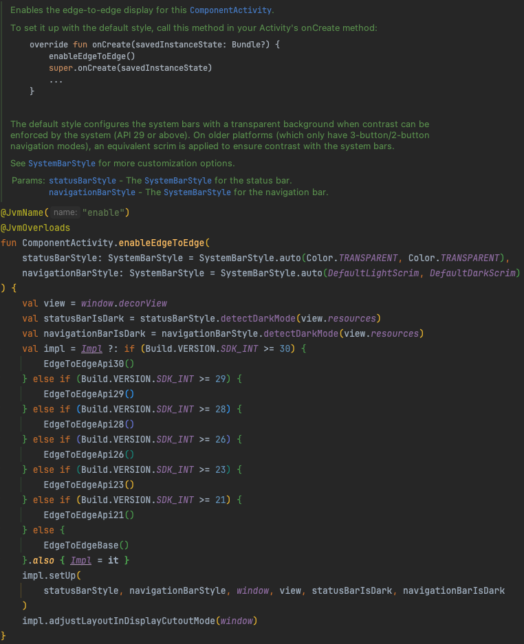

## enableEdgeToEdge는 뭐하는 녀석이지?

### 배경
언제부턴가 프로젝트를 생성하면 enableEdgeToEdge가 붙어있는 것을 확인할 수 있습니다.
이 메소드와 최근 이슈가 있었기에 하나씩 정리해보려고 합니다!

### enableEdgeToEdge가 해주는 역할
이전에는 더 넓은 화면 디스플레이를 사용하기 위해 `WindowCompat.setDecorFitsSystemWindows(window, false)` 를 사용해줘야 했습니다.
또한 앱의 콘텐츠가 보이도록 시스템 표시줄의 색상을 변경해주는 작업도 필요했습니다 [공식 홈페이지](https://developer.android.com/develop/ui/views/layout/edge-to-edge-manually?hl=ko)

하지만 이제는 enableEdgeToEdge가 처음부터 설정해줍니다.

### enableEdgeToEdge 내부 동작

주석엔 다음과 같이 설명되어 있습니다.
> 기본 스타일은 시스템에서 대비를 강제 적용할 수 있는 경우 시스템 바를 투명 배경으로 설정합니다. (API 29 이상부터) 
> 구형 플랫폼 (3버튼/2버튼 네비게이션 모드만 있는 플랫폼)에서는 시스템 바와 콘텐츠의 대비를 보장하기 위해 동일한 효과의 스크림이 적용됩니다.

코드를 보면 정말 편리하게 각 Build Version에 맞춰 설정을 해주고 있습니다.

바텀 네비게이션도 투명색으로 지정되기 때문에 배경색에 영향을 받는 것을 볼 수 있습니다

