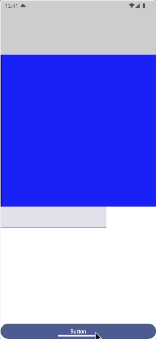

## Android Compose 키보드 영역에 따른 패딩 적용 방법 (imePadding)

### 배경
Compose에서 imePadding을 적용하면 키보드 영역에 따라 패딩이 설정되도록 도와주는 설정입니다. 

### 방법
정답부터 빠르게 알려드리자면 다음 순서대로 적용해주시면 됩니다.
1. 먼저 키보드에 따라 화면이 반응하도록 변경하려면 windowSoftInputMode를 변경
```xml
<activity android:name=".MainActivity"
          android:windowSoftInputMode="adjustResize" /> 
```

2. 해당 UI에 imePadding() 붙이기
```kotlin
Box(
    modifier = Modifier
        .fillMaxSize()
        .imePadding(),
)
```

3. Activity에 enableEdgeToEdge() 메소드가 붙어있는지 확인
만약 없다면 style에서 설정해줘야하기 때문에 편리하게 enableEdgeToEdge()를 붙여주는 것이 좋습니다

### 예제 코드
상하단에 TextField와 버튼을 놓고 키보드가 올라왔을 때 UI 변경되는지 확인해봤습니다




```kotlin
fun Screen() {
    var text by remember { mutableStateOf("") }

    Column(
        modifier = Modifier
            .fillMaxSize()
            .imePadding(),
    ) {
        Spacer(
            modifier = Modifier
                .fillMaxWidth()
                .height(140.dp)
                .background(Color.LightGray)
        )

        Column(
            modifier = Modifier
                .weight(1f)
                .verticalScroll(rememberScrollState())
        ) {
            Spacer(
                modifier = Modifier
                    .fillMaxWidth()
                    .height(400.dp)
                    .background(Color.Blue))


            TextField(
                modifier = Modifier
                    .background(Color.LightGray),
                value = text,
                onValueChange = { text = it }
            )
        }

        Button(
            modifier = Modifier
                .fillMaxWidth(),
            onClick = {}
        ) {
            Text(text = "Button")
        }
    }
}
```

