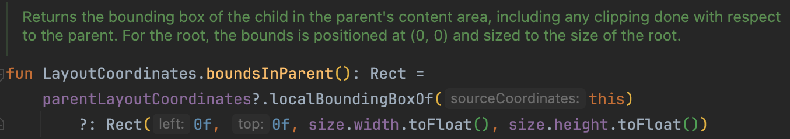
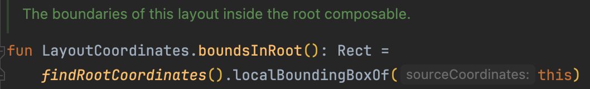
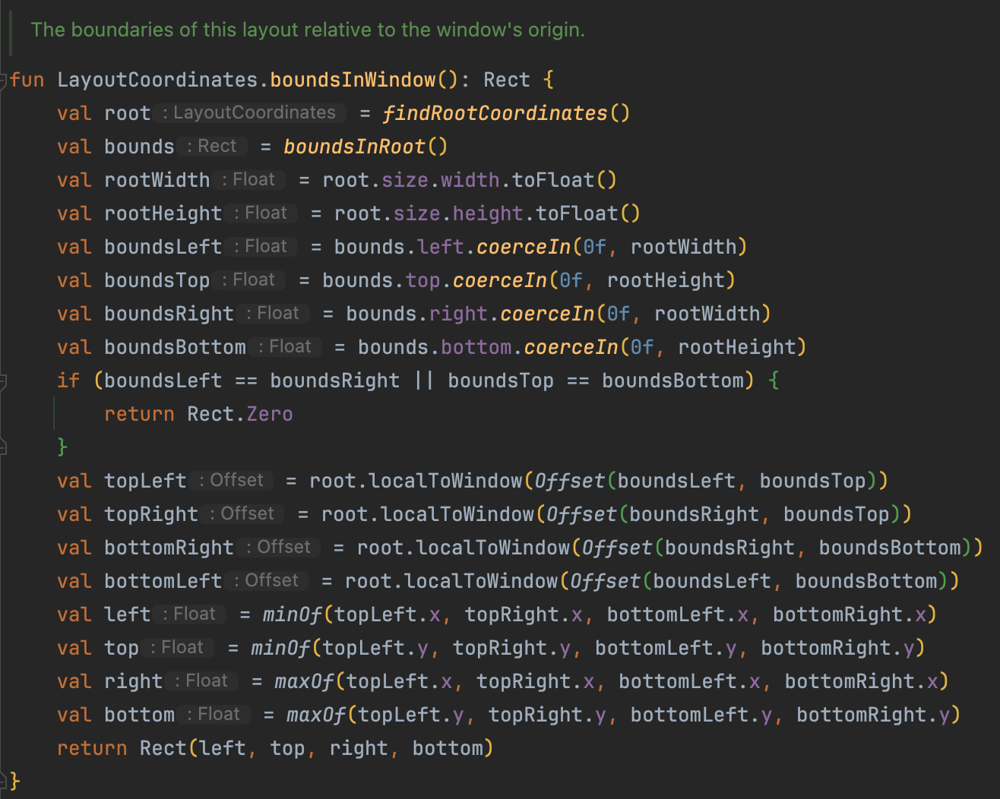
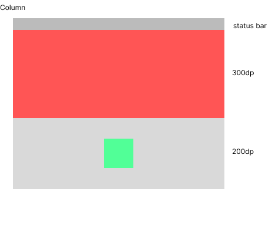
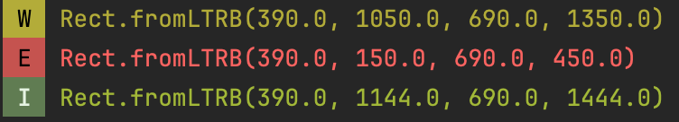
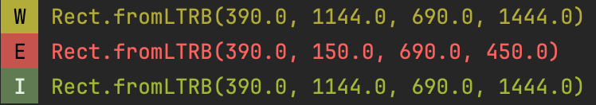

## onGloballyPositioned - bounds 속성들

### bounds 속성들

<b>boundsInParent</b>

이름만 봤을 때 부모 컴포저블을 기준으로 위치가 잡힐 것으로 예상되는데 한번 확인해보겠습니다.



> 자식 composable의 부모 content 영역에서의 경계 상자를 반환합니다. 여기에는 부모에 의해 수행된 모든 클리핑이 포함됩니다. 
> 루트의 경우 경계 상자는 (0, 0) 위치에 배치되고 루트의 크기와 동일한 크기를 가집니다.

<b>boundsInRoot</b>



> 이 레이아웃의 루트 composable 내에서의 경계

를 뜻합니다.



<b>boundsInWindow</b>

> window의 기준점을 기준으로 해당 layout의 경계

를 뜻합니다.

이렇게 설명만 보면 Root랑 Window랑 크게 차이가 없는거 아니야? 라고 느껴질 수 있습니다.

그래서 예제코드를 통해 값이 어떻게 변경되는지 확인해보고자 합니다.

### 컴포넌트 배치에 따른 값 변경

아래 그림처럼 Colum 안에 위에서부터 300dp 아래에 있는 Box 중간에 Box를 만들어 보겠습니다.



```kotlin
override fun onCreate(savedInstanceState: Bundle?) {
    super.onCreate(savedInstanceState)

    setContent {
        ComposeTestTheme {
            Column(
                modifier = Modifier
                    .fillMaxSize()
            ) {
                Spacer(
                    modifier = Modifier
                        .height(300.dp)
                        .background(Color.Red)
                )
                Box(
                    modifier = Modifier
                        .fillMaxWidth()
                        .height(200.dp)
                        .background(Color.LightGray)
                ) {
                    Spacer(
                        modifier = Modifier
                            .size(100.dp)
                            .background(Color.Green)
                            .align(Alignment.Center)
                            .onGloballyPositioned {
                                Log.w("JGeun", "${it.boundsInRoot()}")
                                Log.e("JGeun", "${it.boundsInParent()}")
                                Log.i("JGeun", "${it.boundsInWindow()}")
                            }
                    )
                }
            }
        }
    }
}
```

결과는 다음과 같이 각각 다른 값으로 노출됩니다. (left, top, right, bottom)



boundsInParent

-> 회색 box를 기준으로 bounds가 잡히기 때문에 상대적으로 값이 작은 것을 확인할 수 있습니다

boundsInRoot()와 boundsInWindow()

-> 기기의 좌측 최상단을 기준으로 측정되었지만 Status bar 높이 때문에 top, bottom 값이 다른 것을 볼 수 있습니다.

여기서 enableEdgeToEdge() 메소드와 windowInsetsPadding(WindowInsets.systemBars)가 추가되면 Window로 측정했을 때와 동일한 값을 반환할 것입니다.

