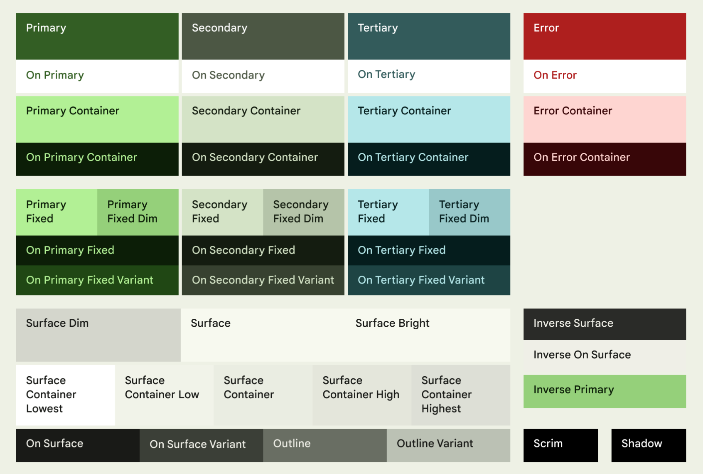
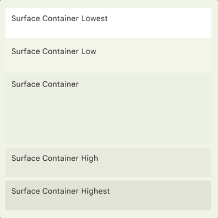
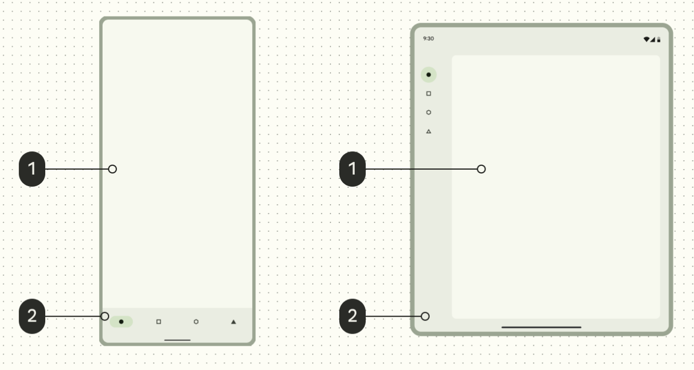
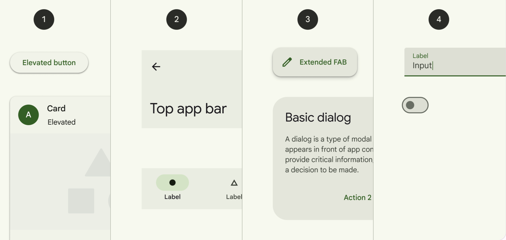
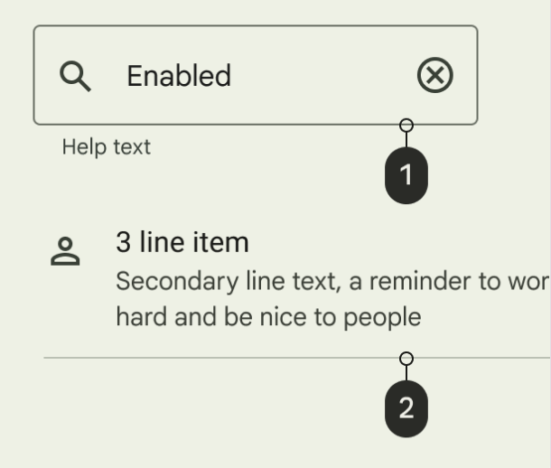
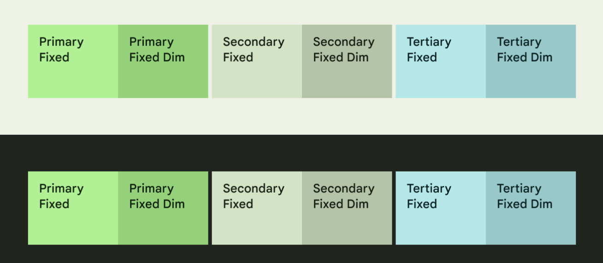
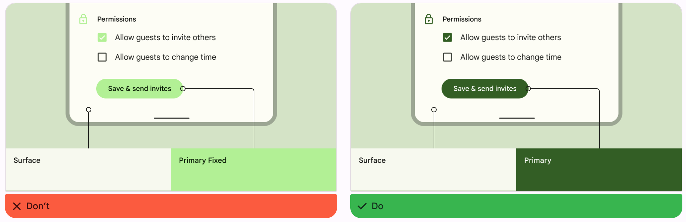
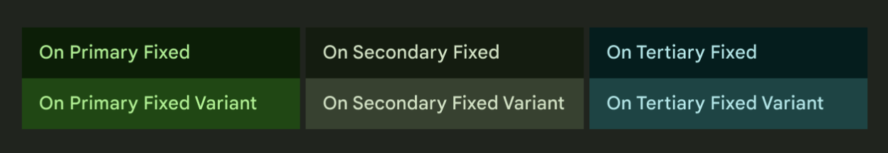
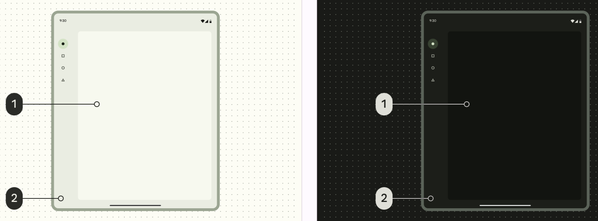
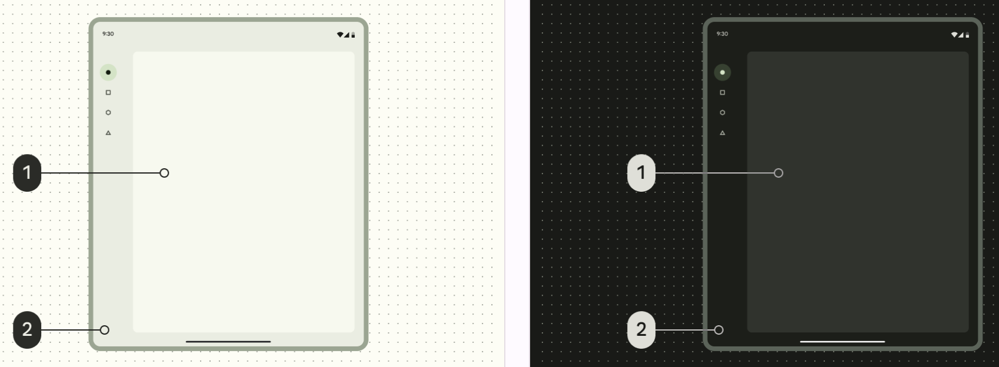

### 기본 개념

- **Surface**: 카드나 시트 같은 요소에 적용되는 **배경색**
- **Primary, Secondary, Tertiary**: 전경 요소들을 강조하거나 저감하기 위해 사용되는 **강조 색상 역할**
- **Container**: 버튼과 같은 전경 요소들을 **채우는 색으로서 사용**
- **On**: 이 용어로 시작하는 색상들은 페어를 이루는 부모 색상 위에 표시된 **텍스트나 아이콘의 색상**
    - 예를 들어 on primary는 primary fill color와 반대되는 색상으로 아이콘과 텍스트에 사용
- **Variant**: 이 용어로 끝나는 역할은 **non-variant 쌍에 대한 더 낮은 강조 대안을 제공**
    - 예를 들어 윤곽선 varient은 윤곽선 색상보다 덜 강조된 버전

### **Primary**

FAB, 강조 버튼, 활성 상태 등 UI 전체에서 **가장 눈에 띄는 구성 요소에 Primary role을 사용**

### **Secondary**

필터 칩과 같이 UI에서 **눈에 띄지 않는 구성 요소에는 Secondary Role을 사용**

### **Tertiary**

**기본 색상과 보조 색상의 균형을 맞추거**나 입력 필드와 같은 요소에 **주의를 집중시키는 대조 액센트에 Tertiary Role 을 사용**

### Error

Error Role을 사용하여 텍스트 필드에 잘못된 비밀번호를 입력하는 등 **오류 상태를 전달**

### **Surface**

**보다 중립적인 배경에는 Surface Role을 사용**하고 카드, 시트, 대화 상자와 같은 구성 요소에는 **컨테이너 색상을 사용**하세요.

1. Surface / 2. Surface container

1) Surface container low

2) Surface container

3) Surface container high

4) Surface container highest

### Inverse colors

Inverse Role은 구성 요소에 선택적으로 적용되어 **주변 UI의 색상과 반대되는 색상을 구현하여 대비 효과를 생성**

### Outline

- Outline: 텍스트 필드 개요와 같은 중요한 경계
- Outline variant: 구분선과 같은 장식 요소

1) textfield에 container border로서 outline 적용

2) 구분선에 outline variant 사용

주의 사항

- 카드같이 여러번 사용되는 요소에는 outline variant를 사용
- chips 같이 모여있는 요소들에는 outline이나 3:1 대비를 제공하는 다른 색상을 사용
- 시각적 계층을 생성하거나 대상의 시각적 경계를 정의하기 위해서는 outline 또는 3:1 대비를 제공하는 다른 색상을 사용

### Fixed accent colors

Fixed Color

- Primary fixed, secondary fixed, tertiary fixed**는** surface에 사용되는 채우기 색상
- 이러한 색상은 밝은 테마와 어두운 테마에서 동일한 톤을 유지하며, 일반 container 색상은 이러한 테마 사이에서 톤이 변경
- 고정된 동작이 필요한 상황에서는 동등한 container 역할 대신 fixed color 역할을 사용가능

Fixed dim

primary fixed dim, secondary fixed dim, tertiary fixed dim 역할들은 동일한 고정 색상에 비해 더 강하고 강조된 톤을 제공합니다. 더 깊은 색상을 사용하지만 동일한 고정 동작이 필요한 경우에 사용할 수 있습니다.

주의점

- container 역할과 마찬가지로 고정 색상은 non-text 대비의 경우 3:1, text 대비의 경우 4.5:1과 같은 최소 대비 요구 사항을 통과하지 못합니다. 이러한 대비가 필요한 요소에는 적용하면 안 됩니다.
- 최소 대비가 필요한 강조 색상에 primary, secondary, tertiary 역할을 사용합니다.

### **On fixed accent colors**

On fixed colors

- 해당 고정 색상 위에 있는 텍스트와 아이콘에 사용
- 예를 들어 on primary fixed는 primary fixed color에 대한 텍스트 및 아이콘에 사용
- 동등한 secondary 및 tertiary 색상에도 동일한 사용법이 적용

On Fixed variant colors

- 해당 고정 색상에 대해 더 낮은 강조가 필요한 텍스트 및 아이콘에 사용
- 예를 들어 on primary fixed variant는 on primary color에 비해 강조가 낮은 텍스트 및 아이콘에 사용
- 동등한 secondary 및 tertiary 색상에도 동일한 사용법이 적용

### **Bright and dim surface roles**

기본 surface 색상은 밝은 테마와 어두운 테마 사이에서 자동으로 반전되지만(밝은 테마에서는 밝은 색상이고 어두운 테마에서는 어두운 색상으로 반전됨) surface의 밝은 색상과 어두운 표면 색상은 약간 다른 방식으로 반전됩니다. 보다 정확하게는 **밝은 테마와 어두운 테마 모두에서 상대적인 밝기를 유지**합니다.
예를 들어 기본 surface 역할을 사용하는 인터페이스에서 매핑된 영역은 밝은 테마에서 가장 밝고 어두운 테마에서 가장 어둡습니다. surface 밝은 역할을 사용하는 인터페이스에서 매핑된 영역은 밝은 테마와 어두운 테마 모두에서 가장 밝습니다.

1) Surface / 2) Surface container

1) Surface bright / 2) Surface container