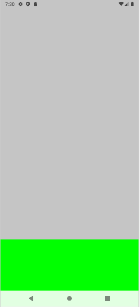
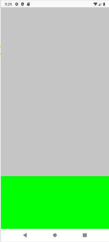

## WindowInsets 종류와 Compose 패딩 설정 방법

현재 프로젝트를 새롭게 생성하면 기본적으로 enableEdgeToEdge()가 적용되어 있습니다. 

xml 기반으로 생성될 때는 다음 코드로 인해 기본적으로 패딩이 설정됩니다.
```kotlin
ViewCompat.setOnApplyWindowInsetsListener(findViewById(R.id.main)) { v, insets ->
  val systemBars = insets.getInsets(WindowInsetsCompat.Type.systemBars())
  v.setPadding(systemBars.left, systemBars.top, systemBars.right, systemBars.bottom)
  insets
}
```

하지만 Compose는 별다른 패딩을 설정해주지 않기 때문에 UI가 시스템 영역을 침범하는 모습을 볼 수 있습니다.

전체 배경을 회색으로 설정하고 하단에 녹색 박스를 배치했을 때 UI에 따라 시스템 영역에 색상이 적용된 것을 확인할 수 있습니다.



시스템 영역에 UI가 침범하는 것을 방지하고자 한다면 우선 WindowInsets 종류에 대해 알아야 합니다.

### WindowInsets Type
- captionBar: 자막 바 영역, 안드로이드 API 30부터 추가된 기능, 안드로이드 10부터 추가된 자막영역에 대해 Inset에 대한 영역
- displayCutout: 스마트폰 상단이나 하단에 위치한 노치, 펀치홀 카메라 영역
- ime: 키보드 입력 영역
- mandatorySystemGestures: 사용자가 기기에서 기본적인 작업을 수행하도록 돕는 시스템 제스처의 하위 집합 ex) 홈, 뒤로 가기 등
- navigationBars: 네비게이션 바 영역
- statusBar: 상태표시줄 영역
- systemBar: 기기 화면의 상단이나 하단에 위치한 영역, 사용자가 시스템 기능에 액세스하고 앱을 제어하는 데 도움이 되는 버튼과 정보를 제공
- systemGestures: 사용자가 기기에서 기본적인 작업을 수행하도록 돕는 제스처의 모음 ex) 음량 조절 제스처, 스크린샷 캡처 제스처 등
- systemOverlays: 시스템 UI 요소 (예: 상태바, 네비게이션 바) 위에 표시되는 추가 레이어 ex) 알림 및 HUD 표시, 화면 어둡게 하기
- tappableElement: 사용자가 화면을 터치하여 상호 작용할 수 있는 영역을 정의 ex) 뷰, 레이아웃

### WindowInsets padding 종류
안드로이드에서 제공되는 큰 묶음의 종류는 3가지가 있습니다.
- safeDrawing
- safeGestures
- safeContent

<b>safeDrawing</b>
systemBars에 키보드와 컷아웃을 포함시킨 형태입니다.
```kotlin
val safeDrawing = systemBars.union(ime).union(displayCutout)
```

<b>safeGestures</b>
tappableElement에 필수 시스템 제스처, 시스템 제스처, waterfall이 포함됩니다.
```kotlin
val waterfall =
    ValueInsets(insets?.displayCutout?.waterfallInsets ?: AndroidXInsets.NONE, "waterfall")

val safeGestures: WindowInsets =
    tappableElement.union(mandatorySystemGestures).union(systemGestures).union(waterfall)
```

<b>safeContent</b>
전체 WindowInsets에 대한 묶음입니다.
```kotlin
val safeContent: WindowInsets = safeDrawing.union(safeGestures)
```

안드로이드에서는 WindowInsets에 대한 padding을 각각 설정하거나 비슷한 부류를 묶어서 제공합니다.
```kotlin
Column(
    modifier = Modifier
        .fillMaxSize()
        .systemBarsPadding()
        .waterfallPadding()
)
```

### 결론
safeDrawingPadding()을 적용하면 게시글 첫 이미지의 문제점을 개선할 수 있습니다.
```kotlin
Column(
    modifier = Modifier
        .fillMaxSize()
        .safeContentPadding()
)
```

